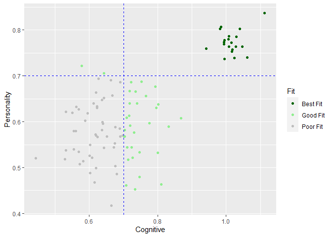

RASP\_Dashboard\_Prototype
================

## Row

### Scatter Plot of Ranger Fit Scores

<!-- -->

### Ranger Fit Table

<table class="table table-striped table-hover table-condensed" style="margin-left: auto; margin-right: auto;">

<thead>

<tr>

<th style="border-bottom:hidden" colspan="1">

</th>

<th style="border-bottom:hidden; padding-bottom:0; padding-left:3px;padding-right:3px;text-align: center; " colspan="3">

Ranger Fit Scores

</th>

<th style="border-bottom:hidden; padding-bottom:0; padding-left:3px;padding-right:3px;text-align: center; " colspan="5">

Personality

</th>

<th style="border-bottom:hidden; padding-bottom:0; padding-left:3px;padding-right:3px;text-align: center; " colspan="2">

Cognitive

</th>

</tr>

<tr>

<th style="text-align:left;position: sticky; top:0; background-color: #FFFFFF;">

ID

</th>

<th style="text-align:right;position: sticky; top:0; background-color: #FFFFFF;">

Fit\_Rank

</th>

<th style="text-align:right;position: sticky; top:0; background-color: #FFFFFF;">

Fit\_Cognitive

</th>

<th style="text-align:right;position: sticky; top:0; background-color: #FFFFFF;">

Fit\_Personality

</th>

<th style="text-align:right;position: sticky; top:0; background-color: #FFFFFF;">

Analytical

</th>

<th style="text-align:right;position: sticky; top:0; background-color: #FFFFFF;">

Dependable

</th>

<th style="text-align:right;position: sticky; top:0; background-color: #FFFFFF;">

Emotional

</th>

<th style="text-align:right;position: sticky; top:0; background-color: #FFFFFF;">

Extroverted

</th>

<th style="text-align:right;position: sticky; top:0; background-color: #FFFFFF;">

Opportunistic

</th>

<th style="text-align:right;position: sticky; top:0; background-color: #FFFFFF;">

Performance

</th>

<th style="text-align:right;position: sticky; top:0; background-color: #FFFFFF;">

Verbal

</th>

</tr>

</thead>

<tbody>

<tr grouplength="20">

<td colspan="11" style="border-bottom: 1px solid;">

<strong>Best Fit</strong>

</td>

</tr>

<tr>

<td style="text-align:left; padding-left: 2em;" indentlevel="1">

A5498

</td>

<td style="text-align:right;">

1

</td>

<td style="text-align:right;">

1.11

</td>

<td style="text-align:right;">

0.84

</td>

<td style="text-align:right;">

81

</td>

<td style="text-align:right;">

53

</td>

<td style="text-align:right;">

78

</td>

<td style="text-align:right;">

60

</td>

<td style="text-align:right;">

66

</td>

<td style="text-align:right;">

82

</td>

<td style="text-align:right;">

65

</td>

</tr>

<tr>

<td style="text-align:left; padding-left: 2em;" indentlevel="1">

A8422

</td>

<td style="text-align:right;">

2

</td>

<td style="text-align:right;">

1.04

</td>

<td style="text-align:right;">

0.80

</td>

<td style="text-align:right;">

79

</td>

<td style="text-align:right;">

49

</td>

<td style="text-align:right;">

74

</td>

<td style="text-align:right;">

59

</td>

<td style="text-align:right;">

62

</td>

<td style="text-align:right;">

79

</td>

<td style="text-align:right;">

66

</td>

</tr>

<tr>

<td style="text-align:left; padding-left: 2em;" indentlevel="1">

A3582

</td>

<td style="text-align:right;">

3

</td>

<td style="text-align:right;">

1.03

</td>

<td style="text-align:right;">

0.79

</td>

<td style="text-align:right;">

87

</td>

<td style="text-align:right;">

46

</td>

<td style="text-align:right;">

67

</td>

<td style="text-align:right;">

58

</td>

<td style="text-align:right;">

56

</td>

<td style="text-align:right;">

77

</td>

<td style="text-align:right;">

64

</td>

</tr>

<tr>

<td style="text-align:left; padding-left: 2em;" indentlevel="1">

A4959

</td>

<td style="text-align:right;">

4

</td>

<td style="text-align:right;">

1.05

</td>

<td style="text-align:right;">

0.76

</td>

<td style="text-align:right;">

86

</td>

<td style="text-align:right;">

43

</td>

<td style="text-align:right;">

76

</td>

<td style="text-align:right;">

65

</td>

<td style="text-align:right;">

52

</td>

<td style="text-align:right;">

77

</td>

<td style="text-align:right;">

68

</td>

</tr>

<tr>

<td style="text-align:left; padding-left: 2em;" indentlevel="1">

A9378

</td>

<td style="text-align:right;">

5

</td>

<td style="text-align:right;">

1.06

</td>

<td style="text-align:right;">

0.74

</td>

<td style="text-align:right;">

80

</td>

<td style="text-align:right;">

42

</td>

<td style="text-align:right;">

65

</td>

<td style="text-align:right;">

59

</td>

<td style="text-align:right;">

45

</td>

<td style="text-align:right;">

78

</td>

<td style="text-align:right;">

64

</td>

</tr>

<tr>

<td style="text-align:left; padding-left: 2em;" indentlevel="1">

A8447

</td>

<td style="text-align:right;">

6

</td>

<td style="text-align:right;">

1.01

</td>

<td style="text-align:right;">

0.79

</td>

<td style="text-align:right;">

84

</td>

<td style="text-align:right;">

41

</td>

<td style="text-align:right;">

69

</td>

<td style="text-align:right;">

64

</td>

<td style="text-align:right;">

54

</td>

<td style="text-align:right;">

73

</td>

<td style="text-align:right;">

72

</td>

</tr>

<tr>

<td style="text-align:left; padding-left: 2em;" indentlevel="1">

A3838

</td>

<td style="text-align:right;">

7

</td>

<td style="text-align:right;">

1.03

</td>

<td style="text-align:right;">

0.76

</td>

<td style="text-align:right;">

78

</td>

<td style="text-align:right;">

43

</td>

<td style="text-align:right;">

77

</td>

<td style="text-align:right;">

69

</td>

<td style="text-align:right;">

56

</td>

<td style="text-align:right;">

75

</td>

<td style="text-align:right;">

65

</td>

</tr>

<tr>

<td style="text-align:left; padding-left: 2em;" indentlevel="1">

A2710

</td>

<td style="text-align:right;">

8

</td>

<td style="text-align:right;">

0.98

</td>

<td style="text-align:right;">

0.81

</td>

<td style="text-align:right;">

83

</td>

<td style="text-align:right;">

44

</td>

<td style="text-align:right;">

80

</td>

<td style="text-align:right;">

59

</td>

<td style="text-align:right;">

49

</td>

<td style="text-align:right;">

77

</td>

<td style="text-align:right;">

59

</td>

</tr>

<tr>

<td style="text-align:left; padding-left: 2em;" indentlevel="1">

A6947

</td>

<td style="text-align:right;">

9

</td>

<td style="text-align:right;">

1.01

</td>

<td style="text-align:right;">

0.77

</td>

<td style="text-align:right;">

79

</td>

<td style="text-align:right;">

46

</td>

<td style="text-align:right;">

66

</td>

<td style="text-align:right;">

70

</td>

<td style="text-align:right;">

44

</td>

<td style="text-align:right;">

75

</td>

<td style="text-align:right;">

73

</td>

</tr>

<tr>

<td style="text-align:left; padding-left: 2em;" indentlevel="1">

A1000

</td>

<td style="text-align:right;">

10

</td>

<td style="text-align:right;">

1.01

</td>

<td style="text-align:right;">

0.78

</td>

<td style="text-align:right;">

84

</td>

<td style="text-align:right;">

47

</td>

<td style="text-align:right;">

72

</td>

<td style="text-align:right;">

62

</td>

<td style="text-align:right;">

60

</td>

<td style="text-align:right;">

78

</td>

<td style="text-align:right;">

69

</td>

</tr>

<tr>

<td style="text-align:left; padding-left: 2em;" indentlevel="1">

A6766

</td>

<td style="text-align:right;">

11

</td>

<td style="text-align:right;">

0.98

</td>

<td style="text-align:right;">

0.80

</td>

<td style="text-align:right;">

86

</td>

<td style="text-align:right;">

41

</td>

<td style="text-align:right;">

78

</td>

<td style="text-align:right;">

66

</td>

<td style="text-align:right;">

52

</td>

<td style="text-align:right;">

71

</td>

<td style="text-align:right;">

72

</td>

</tr>

<tr>

<td style="text-align:left; padding-left: 2em;" indentlevel="1">

A6894

</td>

<td style="text-align:right;">

12

</td>

<td style="text-align:right;">

1.02

</td>

<td style="text-align:right;">

0.76

</td>

<td style="text-align:right;">

83

</td>

<td style="text-align:right;">

44

</td>

<td style="text-align:right;">

66

</td>

<td style="text-align:right;">

76

</td>

<td style="text-align:right;">

60

</td>

<td style="text-align:right;">

76

</td>

<td style="text-align:right;">

64

</td>

</tr>

<tr>

<td style="text-align:left; padding-left: 2em;" indentlevel="1">

A6765

</td>

<td style="text-align:right;">

13

</td>

<td style="text-align:right;">

1.00

</td>

<td style="text-align:right;">

0.78

</td>

<td style="text-align:right;">

84

</td>

<td style="text-align:right;">

40

</td>

<td style="text-align:right;">

80

</td>

<td style="text-align:right;">

60

</td>

<td style="text-align:right;">

57

</td>

<td style="text-align:right;">

74

</td>

<td style="text-align:right;">

65

</td>

</tr>

<tr>

<td style="text-align:left; padding-left: 2em;" indentlevel="1">

A2739

</td>

<td style="text-align:right;">

14

</td>

<td style="text-align:right;">

1.01

</td>

<td style="text-align:right;">

0.76

</td>

<td style="text-align:right;">

85

</td>

<td style="text-align:right;">

42

</td>

<td style="text-align:right;">

65

</td>

<td style="text-align:right;">

66

</td>

<td style="text-align:right;">

55

</td>

<td style="text-align:right;">

77

</td>

<td style="text-align:right;">

69

</td>

</tr>

<tr>

<td style="text-align:left; padding-left: 2em;" indentlevel="1">

A9727

</td>

<td style="text-align:right;">

15

</td>

<td style="text-align:right;">

1.02

</td>

<td style="text-align:right;">

0.75

</td>

<td style="text-align:right;">

84

</td>

<td style="text-align:right;">

40

</td>

<td style="text-align:right;">

69

</td>

<td style="text-align:right;">

65

</td>

<td style="text-align:right;">

46

</td>

<td style="text-align:right;">

74

</td>

<td style="text-align:right;">

64

</td>

</tr>

<tr>

<td style="text-align:left; padding-left: 2em;" indentlevel="1">

A6244

</td>

<td style="text-align:right;">

16

</td>

<td style="text-align:right;">

0.99

</td>

<td style="text-align:right;">

0.77

</td>

<td style="text-align:right;">

83

</td>

<td style="text-align:right;">

41

</td>

<td style="text-align:right;">

79

</td>

<td style="text-align:right;">

59

</td>

<td style="text-align:right;">

54

</td>

<td style="text-align:right;">

76

</td>

<td style="text-align:right;">

68

</td>

</tr>

<tr>

<td style="text-align:left; padding-left: 2em;" indentlevel="1">

A3632

</td>

<td style="text-align:right;">

17

</td>

<td style="text-align:right;">

1.02

</td>

<td style="text-align:right;">

0.74

</td>

<td style="text-align:right;">

82

</td>

<td style="text-align:right;">

45

</td>

<td style="text-align:right;">

79

</td>

<td style="text-align:right;">

68

</td>

<td style="text-align:right;">

56

</td>

<td style="text-align:right;">

79

</td>

<td style="text-align:right;">

65

</td>

</tr>

<tr>

<td style="text-align:left; padding-left: 2em;" indentlevel="1">

A2449

</td>

<td style="text-align:right;">

18

</td>

<td style="text-align:right;">

0.99

</td>

<td style="text-align:right;">

0.77

</td>

<td style="text-align:right;">

86

</td>

<td style="text-align:right;">

40

</td>

<td style="text-align:right;">

72

</td>

<td style="text-align:right;">

53

</td>

<td style="text-align:right;">

52

</td>

<td style="text-align:right;">

76

</td>

<td style="text-align:right;">

66

</td>

</tr>

<tr>

<td style="text-align:left; padding-left: 2em;" indentlevel="1">

A4387

</td>

<td style="text-align:right;">

19

</td>

<td style="text-align:right;">

0.99

</td>

<td style="text-align:right;">

0.74

</td>

<td style="text-align:right;">

84

</td>

<td style="text-align:right;">

40

</td>

<td style="text-align:right;">

68

</td>

<td style="text-align:right;">

57

</td>

<td style="text-align:right;">

48

</td>

<td style="text-align:right;">

73

</td>

<td style="text-align:right;">

64

</td>

</tr>

<tr>

<td style="text-align:left; padding-left: 2em;" indentlevel="1">

A8968

</td>

<td style="text-align:right;">

20

</td>

<td style="text-align:right;">

0.94

</td>

<td style="text-align:right;">

0.76

</td>

<td style="text-align:right;">

82

</td>

<td style="text-align:right;">

48

</td>

<td style="text-align:right;">

75

</td>

<td style="text-align:right;">

70

</td>

<td style="text-align:right;">

50

</td>

<td style="text-align:right;">

73

</td>

<td style="text-align:right;">

60

</td>

</tr>

<tr grouplength="7">

<td colspan="11" style="border-bottom: 1px solid;">

<strong>Good Fit</strong>

</td>

</tr>

<tr>

<td style="text-align:left; padding-left: 2em;" indentlevel="1">

F2063

</td>

<td style="text-align:right;">

21

</td>

<td style="text-align:right;">

0.87

</td>

<td style="text-align:right;">

0.61

</td>

<td style="text-align:right;">

47

</td>

<td style="text-align:right;">

47

</td>

<td style="text-align:right;">

50

</td>

<td style="text-align:right;">

56

</td>

<td style="text-align:right;">

54

</td>

<td style="text-align:right;">

65

</td>

<td style="text-align:right;">

44

</td>

</tr>

<tr>

<td style="text-align:left; padding-left: 2em;" indentlevel="1">

D6687

</td>

<td style="text-align:right;">

22

</td>

<td style="text-align:right;">

0.79

</td>

<td style="text-align:right;">

0.68

</td>

<td style="text-align:right;">

55

</td>

<td style="text-align:right;">

59

</td>

<td style="text-align:right;">

59

</td>

<td style="text-align:right;">

33

</td>

<td style="text-align:right;">

54

</td>

<td style="text-align:right;">

59

</td>

<td style="text-align:right;">

41

</td>

</tr>

<tr>

<td style="text-align:left; padding-left: 2em;" indentlevel="1">

F3226

</td>

<td style="text-align:right;">

23

</td>

<td style="text-align:right;">

0.75

</td>

<td style="text-align:right;">

0.69

</td>

<td style="text-align:right;">

62

</td>

<td style="text-align:right;">

60

</td>

<td style="text-align:right;">

46

</td>

<td style="text-align:right;">

37

</td>

<td style="text-align:right;">

50

</td>

<td style="text-align:right;">

55

</td>

<td style="text-align:right;">

53

</td>

</tr>

<tr>

<td style="text-align:left; padding-left: 2em;" indentlevel="1">

B2320

</td>

<td style="text-align:right;">

24

</td>

<td style="text-align:right;">

0.80

</td>

<td style="text-align:right;">

0.64

</td>

<td style="text-align:right;">

50

</td>

<td style="text-align:right;">

50

</td>

<td style="text-align:right;">

58

</td>

<td style="text-align:right;">

48

</td>

<td style="text-align:right;">

51

</td>

<td style="text-align:right;">

56

</td>

<td style="text-align:right;">

64

</td>

</tr>

<tr>

<td style="text-align:left; padding-left: 2em;" indentlevel="1">

C5183

</td>

<td style="text-align:right;">

25

</td>

<td style="text-align:right;">

0.80

</td>

<td style="text-align:right;">

0.63

</td>

<td style="text-align:right;">

55

</td>

<td style="text-align:right;">

38

</td>

<td style="text-align:right;">

47

</td>

<td style="text-align:right;">

35

</td>

<td style="text-align:right;">

60

</td>

<td style="text-align:right;">

62

</td>

<td style="text-align:right;">

53

</td>

</tr>

<tr>

<td style="text-align:left; padding-left: 2em;" indentlevel="1">

B6269

</td>

<td style="text-align:right;">

26

</td>

<td style="text-align:right;">

0.83

</td>

<td style="text-align:right;">

0.59

</td>

<td style="text-align:right;">

52

</td>

<td style="text-align:right;">

46

</td>

<td style="text-align:right;">

41

</td>

<td style="text-align:right;">

35

</td>

<td style="text-align:right;">

53

</td>

<td style="text-align:right;">

61

</td>

<td style="text-align:right;">

47

</td>

</tr>

<tr>

<td style="text-align:left; padding-left: 2em;" indentlevel="1">

D6881

</td>

<td style="text-align:right;">

27

</td>

<td style="text-align:right;">

0.76

</td>

<td style="text-align:right;">

0.66

</td>

<td style="text-align:right;">

48

</td>

<td style="text-align:right;">

51

</td>

<td style="text-align:right;">

62

</td>

<td style="text-align:right;">

47

</td>

<td style="text-align:right;">

52

</td>

<td style="text-align:right;">

55

</td>

<td style="text-align:right;">

39

</td>

</tr>

<tr grouplength="73">

<td colspan="11" style="border-bottom: 1px solid;">

<strong>Poor Fit</strong>

</td>

</tr>

<tr>

<td style="text-align:left; padding-left: 2em;" indentlevel="1">

D9096

</td>

<td style="text-align:right;">

28

</td>

<td style="text-align:right;">

0.72

</td>

<td style="text-align:right;">

0.69

</td>

<td style="text-align:right;">

60

</td>

<td style="text-align:right;">

65

</td>

<td style="text-align:right;">

45

</td>

<td style="text-align:right;">

57

</td>

<td style="text-align:right;">

62

</td>

<td style="text-align:right;">

57

</td>

<td style="text-align:right;">

55

</td>

</tr>

<tr>

<td style="text-align:left; padding-left: 2em;" indentlevel="1">

B5026

</td>

<td style="text-align:right;">

29

</td>

<td style="text-align:right;">

0.74

</td>

<td style="text-align:right;">

0.67

</td>

<td style="text-align:right;">

64

</td>

<td style="text-align:right;">

44

</td>

<td style="text-align:right;">

59

</td>

<td style="text-align:right;">

46

</td>

<td style="text-align:right;">

66

</td>

<td style="text-align:right;">

60

</td>

<td style="text-align:right;">

45

</td>

</tr>

<tr>

<td style="text-align:left; padding-left: 2em;" indentlevel="1">

C5371

</td>

<td style="text-align:right;">

30

</td>

<td style="text-align:right;">

0.72

</td>

<td style="text-align:right;">

0.67

</td>

<td style="text-align:right;">

51

</td>

<td style="text-align:right;">

52

</td>

<td style="text-align:right;">

55

</td>

<td style="text-align:right;">

34

</td>

<td style="text-align:right;">

49

</td>

<td style="text-align:right;">

53

</td>

<td style="text-align:right;">

64

</td>

</tr>

<tr>

<td style="text-align:left; padding-left: 2em;" indentlevel="1">

F5045

</td>

<td style="text-align:right;">

31

</td>

<td style="text-align:right;">

0.74

</td>

<td style="text-align:right;">

0.64

</td>

<td style="text-align:right;">

54

</td>

<td style="text-align:right;">

53

</td>

<td style="text-align:right;">

52

</td>

<td style="text-align:right;">

44

</td>

<td style="text-align:right;">

66

</td>

<td style="text-align:right;">

57

</td>

<td style="text-align:right;">

55

</td>

</tr>

<tr>

<td style="text-align:left; padding-left: 2em;" indentlevel="1">

C6070

</td>

<td style="text-align:right;">

32

</td>

<td style="text-align:right;">

0.69

</td>

<td style="text-align:right;">

0.69

</td>

<td style="text-align:right;">

51

</td>

<td style="text-align:right;">

65

</td>

<td style="text-align:right;">

61

</td>

<td style="text-align:right;">

40

</td>

<td style="text-align:right;">

58

</td>

<td style="text-align:right;">

52

</td>

<td style="text-align:right;">

43

</td>

</tr>

<tr>

<td style="text-align:left; padding-left: 2em;" indentlevel="1">

C6148

</td>

<td style="text-align:right;">

33

</td>

<td style="text-align:right;">

0.77

</td>

<td style="text-align:right;">

0.60

</td>

<td style="text-align:right;">

53

</td>

<td style="text-align:right;">

47

</td>

<td style="text-align:right;">

59

</td>

<td style="text-align:right;">

45

</td>

<td style="text-align:right;">

52

</td>

<td style="text-align:right;">

58

</td>

<td style="text-align:right;">

53

</td>

</tr>

<tr>

<td style="text-align:left; padding-left: 2em;" indentlevel="1">

B1062

</td>

<td style="text-align:right;">

34

</td>

<td style="text-align:right;">

0.72

</td>

<td style="text-align:right;">

0.64

</td>

<td style="text-align:right;">

50

</td>

<td style="text-align:right;">

51

</td>

<td style="text-align:right;">

62

</td>

<td style="text-align:right;">

53

</td>

<td style="text-align:right;">

52

</td>

<td style="text-align:right;">

48

</td>

<td style="text-align:right;">

52

</td>

</tr>

<tr>

<td style="text-align:left; padding-left: 2em;" indentlevel="1">

F9571

</td>

<td style="text-align:right;">

35

</td>

<td style="text-align:right;">

0.66

</td>

<td style="text-align:right;">

0.69

</td>

<td style="text-align:right;">

57

</td>

<td style="text-align:right;">

45

</td>

<td style="text-align:right;">

64

</td>

<td style="text-align:right;">

33

</td>

<td style="text-align:right;">

74

</td>

<td style="text-align:right;">

49

</td>

<td style="text-align:right;">

59

</td>

</tr>

<tr>

<td style="text-align:left; padding-left: 2em;" indentlevel="1">

B7960

</td>

<td style="text-align:right;">

36

</td>

<td style="text-align:right;">

0.64

</td>

<td style="text-align:right;">

0.71

</td>

<td style="text-align:right;">

60

</td>

<td style="text-align:right;">

49

</td>

<td style="text-align:right;">

63

</td>

<td style="text-align:right;">

57

</td>

<td style="text-align:right;">

68

</td>

<td style="text-align:right;">

43

</td>

<td style="text-align:right;">

59

</td>

</tr>

<tr>

<td style="text-align:left; padding-left: 2em;" indentlevel="1">

D6682

</td>

<td style="text-align:right;">

37

</td>

<td style="text-align:right;">

0.80

</td>

<td style="text-align:right;">

0.53

</td>

<td style="text-align:right;">

43

</td>

<td style="text-align:right;">

52

</td>

<td style="text-align:right;">

50

</td>

<td style="text-align:right;">

53

</td>

<td style="text-align:right;">

50

</td>

<td style="text-align:right;">

55

</td>

<td style="text-align:right;">

53

</td>

</tr>

<tr>

<td style="text-align:left; padding-left: 2em;" indentlevel="1">

B7736

</td>

<td style="text-align:right;">

38

</td>

<td style="text-align:right;">

0.72

</td>

<td style="text-align:right;">

0.61

</td>

<td style="text-align:right;">

55

</td>

<td style="text-align:right;">

43

</td>

<td style="text-align:right;">

47

</td>

<td style="text-align:right;">

71

</td>

<td style="text-align:right;">

55

</td>

<td style="text-align:right;">

57

</td>

<td style="text-align:right;">

53

</td>

</tr>

<tr>

<td style="text-align:left; padding-left: 2em;" indentlevel="1">

C7971

</td>

<td style="text-align:right;">

39

</td>

<td style="text-align:right;">

0.67

</td>

<td style="text-align:right;">

0.66

</td>

<td style="text-align:right;">

60

</td>

<td style="text-align:right;">

60

</td>

<td style="text-align:right;">

62

</td>

<td style="text-align:right;">

43

</td>

<td style="text-align:right;">

32

</td>

<td style="text-align:right;">

49

</td>

<td style="text-align:right;">

50

</td>

</tr>

<tr>

<td style="text-align:left; padding-left: 2em;" indentlevel="1">

F1975

</td>

<td style="text-align:right;">

40

</td>

<td style="text-align:right;">

0.63

</td>

<td style="text-align:right;">

0.69

</td>

<td style="text-align:right;">

56

</td>

<td style="text-align:right;">

62

</td>

<td style="text-align:right;">

58

</td>

<td style="text-align:right;">

30

</td>

<td style="text-align:right;">

61

</td>

<td style="text-align:right;">

43

</td>

<td style="text-align:right;">

54

</td>

</tr>

<tr>

<td style="text-align:left; padding-left: 2em;" indentlevel="1">

C6716

</td>

<td style="text-align:right;">

41

</td>

<td style="text-align:right;">

0.71

</td>

<td style="text-align:right;">

0.61

</td>

<td style="text-align:right;">

52

</td>

<td style="text-align:right;">

47

</td>

<td style="text-align:right;">

48

</td>

<td style="text-align:right;">

59

</td>

<td style="text-align:right;">

59

</td>

<td style="text-align:right;">

51

</td>

<td style="text-align:right;">

40

</td>

</tr>

<tr>

<td style="text-align:left; padding-left: 2em;" indentlevel="1">

D5851

</td>

<td style="text-align:right;">

42

</td>

<td style="text-align:right;">

0.72

</td>

<td style="text-align:right;">

0.59

</td>

<td style="text-align:right;">

56

</td>

<td style="text-align:right;">

34

</td>

<td style="text-align:right;">

59

</td>

<td style="text-align:right;">

51

</td>

<td style="text-align:right;">

48

</td>

<td style="text-align:right;">

52

</td>

<td style="text-align:right;">

42

</td>

</tr>

<tr>

<td style="text-align:left; padding-left: 2em;" indentlevel="1">

F9613

</td>

<td style="text-align:right;">

43

</td>

<td style="text-align:right;">

0.73

</td>

<td style="text-align:right;">

0.58

</td>

<td style="text-align:right;">

59

</td>

<td style="text-align:right;">

37

</td>

<td style="text-align:right;">

65

</td>

<td style="text-align:right;">

30

</td>

<td style="text-align:right;">

38

</td>

<td style="text-align:right;">

51

</td>

<td style="text-align:right;">

50

</td>

</tr>

<tr>

<td style="text-align:left; padding-left: 2em;" indentlevel="1">

D4860

</td>

<td style="text-align:right;">

44

</td>

<td style="text-align:right;">

0.58

</td>

<td style="text-align:right;">

0.72

</td>

<td style="text-align:right;">

58

</td>

<td style="text-align:right;">

65

</td>

<td style="text-align:right;">

44

</td>

<td style="text-align:right;">

62

</td>

<td style="text-align:right;">

66

</td>

<td style="text-align:right;">

42

</td>

<td style="text-align:right;">

44

</td>

</tr>

<tr>

<td style="text-align:left; padding-left: 2em;" indentlevel="1">

D7412

</td>

<td style="text-align:right;">

45

</td>

<td style="text-align:right;">

0.64

</td>

<td style="text-align:right;">

0.65

</td>

<td style="text-align:right;">

52

</td>

<td style="text-align:right;">

56

</td>

<td style="text-align:right;">

59

</td>

<td style="text-align:right;">

70

</td>

<td style="text-align:right;">

50

</td>

<td style="text-align:right;">

46

</td>

<td style="text-align:right;">

55

</td>

</tr>

<tr>

<td style="text-align:left; padding-left: 2em;" indentlevel="1">

B5933

</td>

<td style="text-align:right;">

46

</td>

<td style="text-align:right;">

0.70

</td>

<td style="text-align:right;">

0.58

</td>

<td style="text-align:right;">

53

</td>

<td style="text-align:right;">

57

</td>

<td style="text-align:right;">

48

</td>

<td style="text-align:right;">

47

</td>

<td style="text-align:right;">

26

</td>

<td style="text-align:right;">

56

</td>

<td style="text-align:right;">

51

</td>

</tr>

<tr>

<td style="text-align:left; padding-left: 2em;" indentlevel="1">

F1971

</td>

<td style="text-align:right;">

47

</td>

<td style="text-align:right;">

0.64

</td>

<td style="text-align:right;">

0.65

</td>

<td style="text-align:right;">

58

</td>

<td style="text-align:right;">

53

</td>

<td style="text-align:right;">

58

</td>

<td style="text-align:right;">

40

</td>

<td style="text-align:right;">

30

</td>

<td style="text-align:right;">

44

</td>

<td style="text-align:right;">

57

</td>

</tr>

<tr>

<td style="text-align:left; padding-left: 2em;" indentlevel="1">

F9967

</td>

<td style="text-align:right;">

48

</td>

<td style="text-align:right;">

0.62

</td>

<td style="text-align:right;">

0.66

</td>

<td style="text-align:right;">

58

</td>

<td style="text-align:right;">

51

</td>

<td style="text-align:right;">

47

</td>

<td style="text-align:right;">

53

</td>

<td style="text-align:right;">

62

</td>

<td style="text-align:right;">

45

</td>

<td style="text-align:right;">

51

</td>

</tr>

<tr>

<td style="text-align:left; padding-left: 2em;" indentlevel="1">

F7003

</td>

<td style="text-align:right;">

49

</td>

<td style="text-align:right;">

0.75

</td>

<td style="text-align:right;">

0.53

</td>

<td style="text-align:right;">

42

</td>

<td style="text-align:right;">

57

</td>

<td style="text-align:right;">

48

</td>

<td style="text-align:right;">

57

</td>

<td style="text-align:right;">

52

</td>

<td style="text-align:right;">

56

</td>

<td style="text-align:right;">

54

</td>

</tr>

<tr>

<td style="text-align:left; padding-left: 2em;" indentlevel="1">

F9456

</td>

<td style="text-align:right;">

50

</td>

<td style="text-align:right;">

0.69

</td>

<td style="text-align:right;">

0.59

</td>

<td style="text-align:right;">

44

</td>

<td style="text-align:right;">

47

</td>

<td style="text-align:right;">

49

</td>

<td style="text-align:right;">

43

</td>

<td style="text-align:right;">

52

</td>

<td style="text-align:right;">

47

</td>

<td style="text-align:right;">

63

</td>

</tr>

<tr>

<td style="text-align:left; padding-left: 2em;" indentlevel="1">

C6836

</td>

<td style="text-align:right;">

51

</td>

<td style="text-align:right;">

0.81

</td>

<td style="text-align:right;">

0.46

</td>

<td style="text-align:right;">

40

</td>

<td style="text-align:right;">

49

</td>

<td style="text-align:right;">

28

</td>

<td style="text-align:right;">

44

</td>

<td style="text-align:right;">

52

</td>

<td style="text-align:right;">

65

</td>

<td style="text-align:right;">

48

</td>

</tr>

<tr>

<td style="text-align:left; padding-left: 2em;" indentlevel="1">

F4792

</td>

<td style="text-align:right;">

52

</td>

<td style="text-align:right;">

0.70

</td>

<td style="text-align:right;">

0.57

</td>

<td style="text-align:right;">

53

</td>

<td style="text-align:right;">

39

</td>

<td style="text-align:right;">

46

</td>

<td style="text-align:right;">

52

</td>

<td style="text-align:right;">

46

</td>

<td style="text-align:right;">

50

</td>

<td style="text-align:right;">

49

</td>

</tr>

<tr>

<td style="text-align:left; padding-left: 2em;" indentlevel="1">

D8325

</td>

<td style="text-align:right;">

53

</td>

<td style="text-align:right;">

0.70

</td>

<td style="text-align:right;">

0.57

</td>

<td style="text-align:right;">

47

</td>

<td style="text-align:right;">

57

</td>

<td style="text-align:right;">

60

</td>

<td style="text-align:right;">

42

</td>

<td style="text-align:right;">

50

</td>

<td style="text-align:right;">

51

</td>

<td style="text-align:right;">

53

</td>

</tr>

<tr>

<td style="text-align:left; padding-left: 2em;" indentlevel="1">

B7082

</td>

<td style="text-align:right;">

54

</td>

<td style="text-align:right;">

0.72

</td>

<td style="text-align:right;">

0.54

</td>

<td style="text-align:right;">

52

</td>

<td style="text-align:right;">

55

</td>

<td style="text-align:right;">

41

</td>

<td style="text-align:right;">

63

</td>

<td style="text-align:right;">

50

</td>

<td style="text-align:right;">

49

</td>

<td style="text-align:right;">

56

</td>

</tr>

<tr>

<td style="text-align:left; padding-left: 2em;" indentlevel="1">

B2437

</td>

<td style="text-align:right;">

55

</td>

<td style="text-align:right;">

0.70

</td>

<td style="text-align:right;">

0.57

</td>

<td style="text-align:right;">

50

</td>

<td style="text-align:right;">

46

</td>

<td style="text-align:right;">

42

</td>

<td style="text-align:right;">

55

</td>

<td style="text-align:right;">

68

</td>

<td style="text-align:right;">

51

</td>

<td style="text-align:right;">

59

</td>

</tr>

<tr>

<td style="text-align:left; padding-left: 2em;" indentlevel="1">

D6388

</td>

<td style="text-align:right;">

56

</td>

<td style="text-align:right;">

0.68

</td>

<td style="text-align:right;">

0.59

</td>

<td style="text-align:right;">

48

</td>

<td style="text-align:right;">

45

</td>

<td style="text-align:right;">

46

</td>

<td style="text-align:right;">

45

</td>

<td style="text-align:right;">

52

</td>

<td style="text-align:right;">

51

</td>

<td style="text-align:right;">

48

</td>

</tr>

<tr>

<td style="text-align:left; padding-left: 2em;" indentlevel="1">

D7407

</td>

<td style="text-align:right;">

57

</td>

<td style="text-align:right;">

0.69

</td>

<td style="text-align:right;">

0.57

</td>

<td style="text-align:right;">

38

</td>

<td style="text-align:right;">

49

</td>

<td style="text-align:right;">

55

</td>

<td style="text-align:right;">

44

</td>

<td style="text-align:right;">

50

</td>

<td style="text-align:right;">

46

</td>

<td style="text-align:right;">

51

</td>

</tr>

<tr>

<td style="text-align:left; padding-left: 2em;" indentlevel="1">

F4856

</td>

<td style="text-align:right;">

58

</td>

<td style="text-align:right;">

0.62

</td>

<td style="text-align:right;">

0.63

</td>

<td style="text-align:right;">

48

</td>

<td style="text-align:right;">

58

</td>

<td style="text-align:right;">

51

</td>

<td style="text-align:right;">

48

</td>

<td style="text-align:right;">

62

</td>

<td style="text-align:right;">

42

</td>

<td style="text-align:right;">

57

</td>

</tr>

<tr>

<td style="text-align:left; padding-left: 2em;" indentlevel="1">

D1877

</td>

<td style="text-align:right;">

59

</td>

<td style="text-align:right;">

0.71

</td>

<td style="text-align:right;">

0.54

</td>

<td style="text-align:right;">

50

</td>

<td style="text-align:right;">

36

</td>

<td style="text-align:right;">

58

</td>

<td style="text-align:right;">

48

</td>

<td style="text-align:right;">

48

</td>

<td style="text-align:right;">

51

</td>

<td style="text-align:right;">

43

</td>

</tr>

<tr>

<td style="text-align:left; padding-left: 2em;" indentlevel="1">

B5220

</td>

<td style="text-align:right;">

60

</td>

<td style="text-align:right;">

0.62

</td>

<td style="text-align:right;">

0.63

</td>

<td style="text-align:right;">

56

</td>

<td style="text-align:right;">

55

</td>

<td style="text-align:right;">

45

</td>

<td style="text-align:right;">

60

</td>

<td style="text-align:right;">

52

</td>

<td style="text-align:right;">

48

</td>

<td style="text-align:right;">

45

</td>

</tr>

<tr>

<td style="text-align:left; padding-left: 2em;" indentlevel="1">

C9535

</td>

<td style="text-align:right;">

61

</td>

<td style="text-align:right;">

0.61

</td>

<td style="text-align:right;">

0.64

</td>

<td style="text-align:right;">

51

</td>

<td style="text-align:right;">

70

</td>

<td style="text-align:right;">

52

</td>

<td style="text-align:right;">

51

</td>

<td style="text-align:right;">

54

</td>

<td style="text-align:right;">

49

</td>

<td style="text-align:right;">

57

</td>

</tr>

<tr>

<td style="text-align:left; padding-left: 2em;" indentlevel="1">

B7176

</td>

<td style="text-align:right;">

62

</td>

<td style="text-align:right;">

0.73

</td>

<td style="text-align:right;">

0.52

</td>

<td style="text-align:right;">

45

</td>

<td style="text-align:right;">

52

</td>

<td style="text-align:right;">

40

</td>

<td style="text-align:right;">

37

</td>

<td style="text-align:right;">

50

</td>

<td style="text-align:right;">

55

</td>

<td style="text-align:right;">

55

</td>

</tr>

<tr>

<td style="text-align:left; padding-left: 2em;" indentlevel="1">

C5574

</td>

<td style="text-align:right;">

63

</td>

<td style="text-align:right;">

0.64

</td>

<td style="text-align:right;">

0.60

</td>

<td style="text-align:right;">

44

</td>

<td style="text-align:right;">

48

</td>

<td style="text-align:right;">

72

</td>

<td style="text-align:right;">

52

</td>

<td style="text-align:right;">

70

</td>

<td style="text-align:right;">

44

</td>

<td style="text-align:right;">

53

</td>

</tr>

<tr>

<td style="text-align:left; padding-left: 2em;" indentlevel="1">

F6322

</td>

<td style="text-align:right;">

64

</td>

<td style="text-align:right;">

0.64

</td>

<td style="text-align:right;">

0.60

</td>

<td style="text-align:right;">

50

</td>

<td style="text-align:right;">

58

</td>

<td style="text-align:right;">

49

</td>

<td style="text-align:right;">

47

</td>

<td style="text-align:right;">

49

</td>

<td style="text-align:right;">

47

</td>

<td style="text-align:right;">

37

</td>

</tr>

<tr>

<td style="text-align:left; padding-left: 2em;" indentlevel="1">

B5407

</td>

<td style="text-align:right;">

65

</td>

<td style="text-align:right;">

0.71

</td>

<td style="text-align:right;">

0.52

</td>

<td style="text-align:right;">

35

</td>

<td style="text-align:right;">

34

</td>

<td style="text-align:right;">

46

</td>

<td style="text-align:right;">

38

</td>

<td style="text-align:right;">

60

</td>

<td style="text-align:right;">

50

</td>

<td style="text-align:right;">

50

</td>

</tr>

<tr>

<td style="text-align:left; padding-left: 2em;" indentlevel="1">

D8215

</td>

<td style="text-align:right;">

66

</td>

<td style="text-align:right;">

0.75

</td>

<td style="text-align:right;">

0.48

</td>

<td style="text-align:right;">

48

</td>

<td style="text-align:right;">

35

</td>

<td style="text-align:right;">

37

</td>

<td style="text-align:right;">

29

</td>

<td style="text-align:right;">

53

</td>

<td style="text-align:right;">

51

</td>

<td style="text-align:right;">

67

</td>

</tr>

<tr>

<td style="text-align:left; padding-left: 2em;" indentlevel="1">

F5634

</td>

<td style="text-align:right;">

67

</td>

<td style="text-align:right;">

0.67

</td>

<td style="text-align:right;">

0.55

</td>

<td style="text-align:right;">

53

</td>

<td style="text-align:right;">

52

</td>

<td style="text-align:right;">

54

</td>

<td style="text-align:right;">

61

</td>

<td style="text-align:right;">

52

</td>

<td style="text-align:right;">

51

</td>

<td style="text-align:right;">

50

</td>

</tr>

<tr>

<td style="text-align:left; padding-left: 2em;" indentlevel="1">

C5795

</td>

<td style="text-align:right;">

68

</td>

<td style="text-align:right;">

0.65

</td>

<td style="text-align:right;">

0.57

</td>

<td style="text-align:right;">

43

</td>

<td style="text-align:right;">

56

</td>

<td style="text-align:right;">

45

</td>

<td style="text-align:right;">

49

</td>

<td style="text-align:right;">

42

</td>

<td style="text-align:right;">

49

</td>

<td style="text-align:right;">

51

</td>

</tr>

<tr>

<td style="text-align:left; padding-left: 2em;" indentlevel="1">

C8563

</td>

<td style="text-align:right;">

69

</td>

<td style="text-align:right;">

0.64

</td>

<td style="text-align:right;">

0.58

</td>

<td style="text-align:right;">

49

</td>

<td style="text-align:right;">

50

</td>

<td style="text-align:right;">

59

</td>

<td style="text-align:right;">

44

</td>

<td style="text-align:right;">

56

</td>

<td style="text-align:right;">

45

</td>

<td style="text-align:right;">

40

</td>

</tr>

<tr>

<td style="text-align:left; padding-left: 2em;" indentlevel="1">

B8409

</td>

<td style="text-align:right;">

70

</td>

<td style="text-align:right;">

0.67

</td>

<td style="text-align:right;">

0.54

</td>

<td style="text-align:right;">

36

</td>

<td style="text-align:right;">

50

</td>

<td style="text-align:right;">

51

</td>

<td style="text-align:right;">

55

</td>

<td style="text-align:right;">

52

</td>

<td style="text-align:right;">

44

</td>

<td style="text-align:right;">

59

</td>

</tr>

<tr>

<td style="text-align:left; padding-left: 2em;" indentlevel="1">

C8012

</td>

<td style="text-align:right;">

71

</td>

<td style="text-align:right;">

0.60

</td>

<td style="text-align:right;">

0.62

</td>

<td style="text-align:right;">

52

</td>

<td style="text-align:right;">

58

</td>

<td style="text-align:right;">

53

</td>

<td style="text-align:right;">

56

</td>

<td style="text-align:right;">

46

</td>

<td style="text-align:right;">

43

</td>

<td style="text-align:right;">

49

</td>

</tr>

<tr>

<td style="text-align:left; padding-left: 2em;" indentlevel="1">

B8000

</td>

<td style="text-align:right;">

72

</td>

<td style="text-align:right;">

0.57

</td>

<td style="text-align:right;">

0.63

</td>

<td style="text-align:right;">

53

</td>

<td style="text-align:right;">

70

</td>

<td style="text-align:right;">

55

</td>

<td style="text-align:right;">

43

</td>

<td style="text-align:right;">

56

</td>

<td style="text-align:right;">

43

</td>

<td style="text-align:right;">

51

</td>

</tr>

<tr>

<td style="text-align:left; padding-left: 2em;" indentlevel="1">

D9656

</td>

<td style="text-align:right;">

73

</td>

<td style="text-align:right;">

0.56

</td>

<td style="text-align:right;">

0.63

</td>

<td style="text-align:right;">

55

</td>

<td style="text-align:right;">

42

</td>

<td style="text-align:right;">

66

</td>

<td style="text-align:right;">

58

</td>

<td style="text-align:right;">

71

</td>

<td style="text-align:right;">

38

</td>

<td style="text-align:right;">

49

</td>

</tr>

<tr>

<td style="text-align:left; padding-left: 2em;" indentlevel="1">

F2163

</td>

<td style="text-align:right;">

74

</td>

<td style="text-align:right;">

0.62

</td>

<td style="text-align:right;">

0.57

</td>

<td style="text-align:right;">

54

</td>

<td style="text-align:right;">

42

</td>

<td style="text-align:right;">

54

</td>

<td style="text-align:right;">

46

</td>

<td style="text-align:right;">

46

</td>

<td style="text-align:right;">

48

</td>

<td style="text-align:right;">

52

</td>

</tr>

<tr>

<td style="text-align:left; padding-left: 2em;" indentlevel="1">

B8468

</td>

<td style="text-align:right;">

75

</td>

<td style="text-align:right;">

0.62

</td>

<td style="text-align:right;">

0.57

</td>

<td style="text-align:right;">

44

</td>

<td style="text-align:right;">

62

</td>

<td style="text-align:right;">

54

</td>

<td style="text-align:right;">

57

</td>

<td style="text-align:right;">

54

</td>

<td style="text-align:right;">

46

</td>

<td style="text-align:right;">

43

</td>

</tr>

<tr>

<td style="text-align:left; padding-left: 2em;" indentlevel="1">

C1953

</td>

<td style="text-align:right;">

76

</td>

<td style="text-align:right;">

0.59

</td>

<td style="text-align:right;">

0.60

</td>

<td style="text-align:right;">

63

</td>

<td style="text-align:right;">

53

</td>

<td style="text-align:right;">

37

</td>

<td style="text-align:right;">

42

</td>

<td style="text-align:right;">

38

</td>

<td style="text-align:right;">

47

</td>

<td style="text-align:right;">

38

</td>

</tr>

<tr>

<td style="text-align:left; padding-left: 2em;" indentlevel="1">

B7583

</td>

<td style="text-align:right;">

77

</td>

<td style="text-align:right;">

0.62

</td>

<td style="text-align:right;">

0.57

</td>

<td style="text-align:right;">

57

</td>

<td style="text-align:right;">

39

</td>

<td style="text-align:right;">

50

</td>

<td style="text-align:right;">

57

</td>

<td style="text-align:right;">

41

</td>

<td style="text-align:right;">

46

</td>

<td style="text-align:right;">

60

</td>

</tr>

<tr>

<td style="text-align:left; padding-left: 2em;" indentlevel="1">

C9391

</td>

<td style="text-align:right;">

78

</td>

<td style="text-align:right;">

0.73

</td>

<td style="text-align:right;">

0.45

</td>

<td style="text-align:right;">

35

</td>

<td style="text-align:right;">

44

</td>

<td style="text-align:right;">

42

</td>

<td style="text-align:right;">

63

</td>

<td style="text-align:right;">

47

</td>

<td style="text-align:right;">

59

</td>

<td style="text-align:right;">

46

</td>

</tr>

<tr>

<td style="text-align:left; padding-left: 2em;" indentlevel="1">

D7199

</td>

<td style="text-align:right;">

79

</td>

<td style="text-align:right;">

0.64

</td>

<td style="text-align:right;">

0.54

</td>

<td style="text-align:right;">

45

</td>

<td style="text-align:right;">

53

</td>

<td style="text-align:right;">

35

</td>

<td style="text-align:right;">

46

</td>

<td style="text-align:right;">

56

</td>

<td style="text-align:right;">

47

</td>

<td style="text-align:right;">

40

</td>

</tr>

<tr>

<td style="text-align:left; padding-left: 2em;" indentlevel="1">

D4075

</td>

<td style="text-align:right;">

80

</td>

<td style="text-align:right;">

0.68

</td>

<td style="text-align:right;">

0.50

</td>

<td style="text-align:right;">

48

</td>

<td style="text-align:right;">

46

</td>

<td style="text-align:right;">

37

</td>

<td style="text-align:right;">

49

</td>

<td style="text-align:right;">

46

</td>

<td style="text-align:right;">

52

</td>

<td style="text-align:right;">

59

</td>

</tr>

<tr>

<td style="text-align:left; padding-left: 2em;" indentlevel="1">

D8335

</td>

<td style="text-align:right;">

81

</td>

<td style="text-align:right;">

0.55

</td>

<td style="text-align:right;">

0.62

</td>

<td style="text-align:right;">

58

</td>

<td style="text-align:right;">

50

</td>

<td style="text-align:right;">

49

</td>

<td style="text-align:right;">

59

</td>

<td style="text-align:right;">

54

</td>

<td style="text-align:right;">

40

</td>

<td style="text-align:right;">

40

</td>

</tr>

<tr>

<td style="text-align:left; padding-left: 2em;" indentlevel="1">

B3727

</td>

<td style="text-align:right;">

82

</td>

<td style="text-align:right;">

0.71

</td>

<td style="text-align:right;">

0.46

</td>

<td style="text-align:right;">

48

</td>

<td style="text-align:right;">

43

</td>

<td style="text-align:right;">

39

</td>

<td style="text-align:right;">

66

</td>

<td style="text-align:right;">

36

</td>

<td style="text-align:right;">

52

</td>

<td style="text-align:right;">

46

</td>

</tr>

<tr>

<td style="text-align:left; padding-left: 2em;" indentlevel="1">

B5876

</td>

<td style="text-align:right;">

83

</td>

<td style="text-align:right;">

0.68

</td>

<td style="text-align:right;">

0.49

</td>

<td style="text-align:right;">

44

</td>

<td style="text-align:right;">

52

</td>

<td style="text-align:right;">

53

</td>

<td style="text-align:right;">

35

</td>

<td style="text-align:right;">

43

</td>

<td style="text-align:right;">

52

</td>

<td style="text-align:right;">

55

</td>

</tr>

<tr>

<td style="text-align:left; padding-left: 2em;" indentlevel="1">

C8511

</td>

<td style="text-align:right;">

84

</td>

<td style="text-align:right;">

0.53

</td>

<td style="text-align:right;">

0.62

</td>

<td style="text-align:right;">

55

</td>

<td style="text-align:right;">

64

</td>

<td style="text-align:right;">

29

</td>

<td style="text-align:right;">

40

</td>

<td style="text-align:right;">

58

</td>

<td style="text-align:right;">

42

</td>

<td style="text-align:right;">

53

</td>

</tr>

<tr>

<td style="text-align:left; padding-left: 2em;" indentlevel="1">

B4640

</td>

<td style="text-align:right;">

85

</td>

<td style="text-align:right;">

0.60

</td>

<td style="text-align:right;">

0.55

</td>

<td style="text-align:right;">

56

</td>

<td style="text-align:right;">

39

</td>

<td style="text-align:right;">

55

</td>

<td style="text-align:right;">

47

</td>

<td style="text-align:right;">

46

</td>

<td style="text-align:right;">

47

</td>

<td style="text-align:right;">

53

</td>

</tr>

<tr>

<td style="text-align:left; padding-left: 2em;" indentlevel="1">

F5922

</td>

<td style="text-align:right;">

86

</td>

<td style="text-align:right;">

0.56

</td>

<td style="text-align:right;">

0.58

</td>

<td style="text-align:right;">

56

</td>

<td style="text-align:right;">

43

</td>

<td style="text-align:right;">

44

</td>

<td style="text-align:right;">

57

</td>

<td style="text-align:right;">

41

</td>

<td style="text-align:right;">

37

</td>

<td style="text-align:right;">

50

</td>

</tr>

<tr>

<td style="text-align:left; padding-left: 2em;" indentlevel="1">

C6885

</td>

<td style="text-align:right;">

87

</td>

<td style="text-align:right;">

0.55

</td>

<td style="text-align:right;">

0.58

</td>

<td style="text-align:right;">

49

</td>

<td style="text-align:right;">

46

</td>

<td style="text-align:right;">

44

</td>

<td style="text-align:right;">

50

</td>

<td style="text-align:right;">

53

</td>

<td style="text-align:right;">

42

</td>

<td style="text-align:right;">

51

</td>

</tr>

<tr>

<td style="text-align:left; padding-left: 2em;" indentlevel="1">

C4509

</td>

<td style="text-align:right;">

88

</td>

<td style="text-align:right;">

0.61

</td>

<td style="text-align:right;">

0.52

</td>

<td style="text-align:right;">

52

</td>

<td style="text-align:right;">

44

</td>

<td style="text-align:right;">

58

</td>

<td style="text-align:right;">

58

</td>

<td style="text-align:right;">

51

</td>

<td style="text-align:right;">

38

</td>

<td style="text-align:right;">

55

</td>

</tr>

<tr>

<td style="text-align:left; padding-left: 2em;" indentlevel="1">

C6099

</td>

<td style="text-align:right;">

89

</td>

<td style="text-align:right;">

0.60

</td>

<td style="text-align:right;">

0.53

</td>

<td style="text-align:right;">

52

</td>

<td style="text-align:right;">

44

</td>

<td style="text-align:right;">

48

</td>

<td style="text-align:right;">

61

</td>

<td style="text-align:right;">

48

</td>

<td style="text-align:right;">

45

</td>

<td style="text-align:right;">

38

</td>

</tr>

<tr>

<td style="text-align:left; padding-left: 2em;" indentlevel="1">

F2436

</td>

<td style="text-align:right;">

90

</td>

<td style="text-align:right;">

0.62

</td>

<td style="text-align:right;">

0.50

</td>

<td style="text-align:right;">

38

</td>

<td style="text-align:right;">

47

</td>

<td style="text-align:right;">

58

</td>

<td style="text-align:right;">

43

</td>

<td style="text-align:right;">

56

</td>

<td style="text-align:right;">

47

</td>

<td style="text-align:right;">

42

</td>

</tr>

<tr>

<td style="text-align:left; padding-left: 2em;" indentlevel="1">

F8223

</td>

<td style="text-align:right;">

91

</td>

<td style="text-align:right;">

0.57

</td>

<td style="text-align:right;">

0.53

</td>

<td style="text-align:right;">

44

</td>

<td style="text-align:right;">

55

</td>

<td style="text-align:right;">

52

</td>

<td style="text-align:right;">

51

</td>

<td style="text-align:right;">

40

</td>

<td style="text-align:right;">

43

</td>

<td style="text-align:right;">

51

</td>

</tr>

<tr>

<td style="text-align:left; padding-left: 2em;" indentlevel="1">

F8975

</td>

<td style="text-align:right;">

92

</td>

<td style="text-align:right;">

0.58

</td>

<td style="text-align:right;">

0.51

</td>

<td style="text-align:right;">

44

</td>

<td style="text-align:right;">

43

</td>

<td style="text-align:right;">

51

</td>

<td style="text-align:right;">

39

</td>

<td style="text-align:right;">

44

</td>

<td style="text-align:right;">

46

</td>

<td style="text-align:right;">

39

</td>

</tr>

<tr>

<td style="text-align:left; padding-left: 2em;" indentlevel="1">

D6561

</td>

<td style="text-align:right;">

93

</td>

<td style="text-align:right;">

0.55

</td>

<td style="text-align:right;">

0.54

</td>

<td style="text-align:right;">

52

</td>

<td style="text-align:right;">

41

</td>

<td style="text-align:right;">

51

</td>

<td style="text-align:right;">

68

</td>

<td style="text-align:right;">

58

</td>

<td style="text-align:right;">

43

</td>

<td style="text-align:right;">

38

</td>

</tr>

<tr>

<td style="text-align:left; padding-left: 2em;" indentlevel="1">

D3471

</td>

<td style="text-align:right;">

94

</td>

<td style="text-align:right;">

0.60

</td>

<td style="text-align:right;">

0.49

</td>

<td style="text-align:right;">

46

</td>

<td style="text-align:right;">

40

</td>

<td style="text-align:right;">

48

</td>

<td style="text-align:right;">

45

</td>

<td style="text-align:right;">

39

</td>

<td style="text-align:right;">

44

</td>

<td style="text-align:right;">

42

</td>

</tr>

<tr>

<td style="text-align:left; padding-left: 2em;" indentlevel="1">

D5670

</td>

<td style="text-align:right;">

95

</td>

<td style="text-align:right;">

0.62

</td>

<td style="text-align:right;">

0.47

</td>

<td style="text-align:right;">

40

</td>

<td style="text-align:right;">

40

</td>

<td style="text-align:right;">

60

</td>

<td style="text-align:right;">

42

</td>

<td style="text-align:right;">

35

</td>

<td style="text-align:right;">

49

</td>

<td style="text-align:right;">

43

</td>

</tr>

<tr>

<td style="text-align:left; padding-left: 2em;" indentlevel="1">

F3113

</td>

<td style="text-align:right;">

96

</td>

<td style="text-align:right;">

0.66

</td>

<td style="text-align:right;">

0.42

</td>

<td style="text-align:right;">

38

</td>

<td style="text-align:right;">

45

</td>

<td style="text-align:right;">

44

</td>

<td style="text-align:right;">

60

</td>

<td style="text-align:right;">

40

</td>

<td style="text-align:right;">

49

</td>

<td style="text-align:right;">

52

</td>

</tr>

<tr>

<td style="text-align:left; padding-left: 2em;" indentlevel="1">

C8942

</td>

<td style="text-align:right;">

97

</td>

<td style="text-align:right;">

0.57

</td>

<td style="text-align:right;">

0.51

</td>

<td style="text-align:right;">

46

</td>

<td style="text-align:right;">

34

</td>

<td style="text-align:right;">

48

</td>

<td style="text-align:right;">

46

</td>

<td style="text-align:right;">

46

</td>

<td style="text-align:right;">

45

</td>

<td style="text-align:right;">

45

</td>

</tr>

<tr>

<td style="text-align:left; padding-left: 2em;" indentlevel="1">

C3471

</td>

<td style="text-align:right;">

98

</td>

<td style="text-align:right;">

0.53

</td>

<td style="text-align:right;">

0.54

</td>

<td style="text-align:right;">

52

</td>

<td style="text-align:right;">

38

</td>

<td style="text-align:right;">

59

</td>

<td style="text-align:right;">

56

</td>

<td style="text-align:right;">

50

</td>

<td style="text-align:right;">

41

</td>

<td style="text-align:right;">

39

</td>

</tr>

<tr>

<td style="text-align:left; padding-left: 2em;" indentlevel="1">

D9274

</td>

<td style="text-align:right;">

99

</td>

<td style="text-align:right;">

0.53

</td>

<td style="text-align:right;">

0.52

</td>

<td style="text-align:right;">

43

</td>

<td style="text-align:right;">

44

</td>

<td style="text-align:right;">

42

</td>

<td style="text-align:right;">

50

</td>

<td style="text-align:right;">

44

</td>

<td style="text-align:right;">

41

</td>

<td style="text-align:right;">

46

</td>

</tr>

<tr>

<td style="text-align:left; padding-left: 2em;" indentlevel="1">

B6162

</td>

<td style="text-align:right;">

100

</td>

<td style="text-align:right;">

0.44

</td>

<td style="text-align:right;">

0.52

</td>

<td style="text-align:right;">

54

</td>

<td style="text-align:right;">

42

</td>

<td style="text-align:right;">

53

</td>

<td style="text-align:right;">

48

</td>

<td style="text-align:right;">

40

</td>

<td style="text-align:right;">

33

</td>

<td style="text-align:right;">

49

</td>

</tr>

</tbody>

</table>
