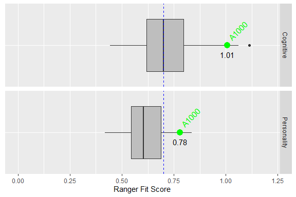

#### Army Research Institute and Northrop Grumman - 3/23/2020

## Individual Report for: A1000
###### This is a demonstration of R and RMarkdown features and published on GitHub Pages (website).  Reports can generate into formats of your choice (html, pdf, Word doc).  This individual report is based on notional Ranger candidate "A1000" results.

### Personality

##### Personality: This graph displays results from the JPI-R Personality Test in **green bars**.

##### The **RED dots** represent the average of all Ranger Candidates.

<!-- -->

### Cognitive

##### Cognitive: This graph displays results from the MAB II Cognitive Test in **green bars**.

##### The **RED dots** represent the average of all Ranger Candidates.

<!-- -->

### Results from the Ranger Fit model for A1000.

###### Ranger Fit Scores are weighted scores based on multiple measures within each category (personality and cognitive). The objective score is 1.0. The dashed blue line represents a threshold Ranger fit score, above which suggests a good fit.

###### The **GREEN dots** represents the Ranger Fit Scores for **A1000** in each category. The total RASP candidate distribution is displayed by the boxplot. This individual’s Ranger Fit Score ranks **10** of **100** in the RASP data repository.

<!-- -->
